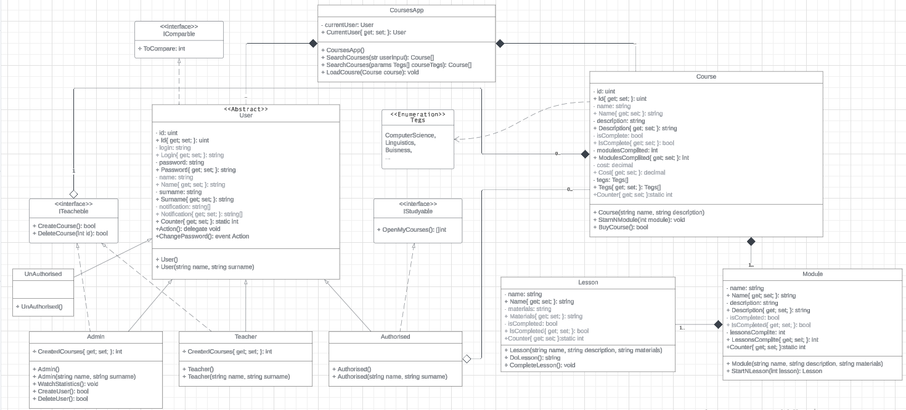

# TelegramBot
**АППЗ .Net Lab2**

Цей бот був створений для опису функціоналу курсового проєкта "Платні навчальні курси".

## Коротко про курсову

Посилання на репозиторій курсової роботи: [Курсова робота](https://github.com/PemzaZevsa/OOP_Cursova)

